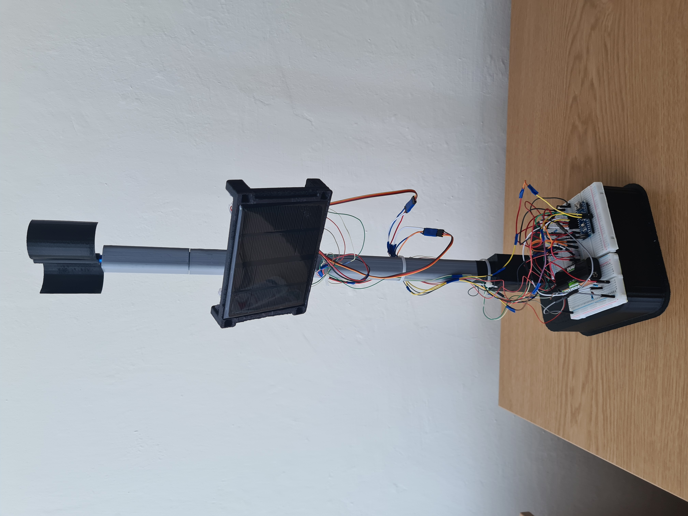
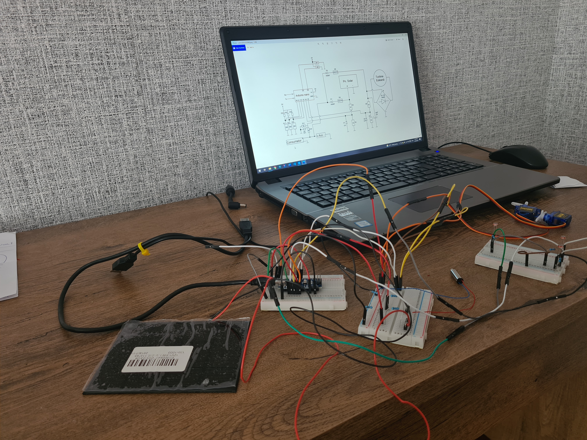
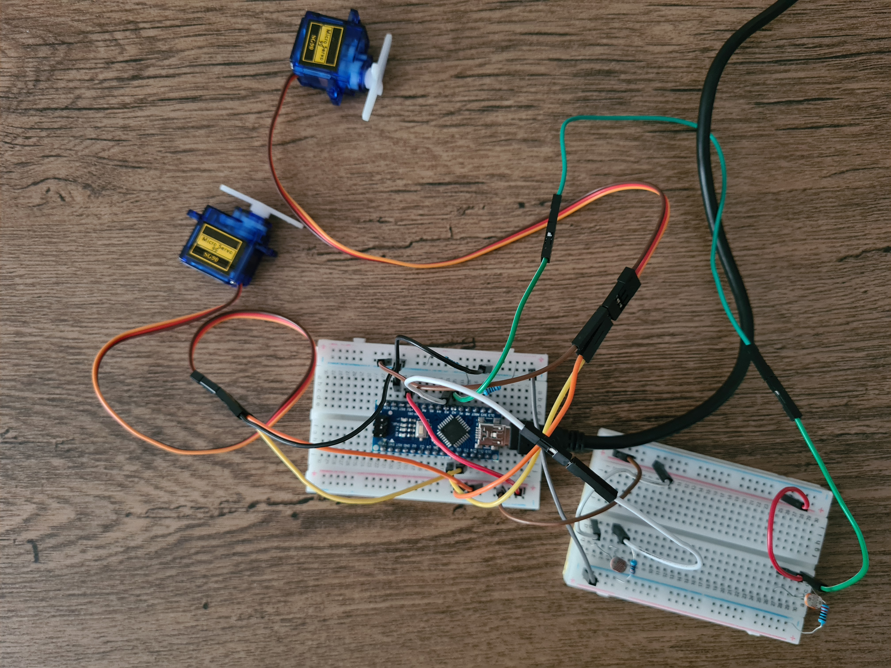
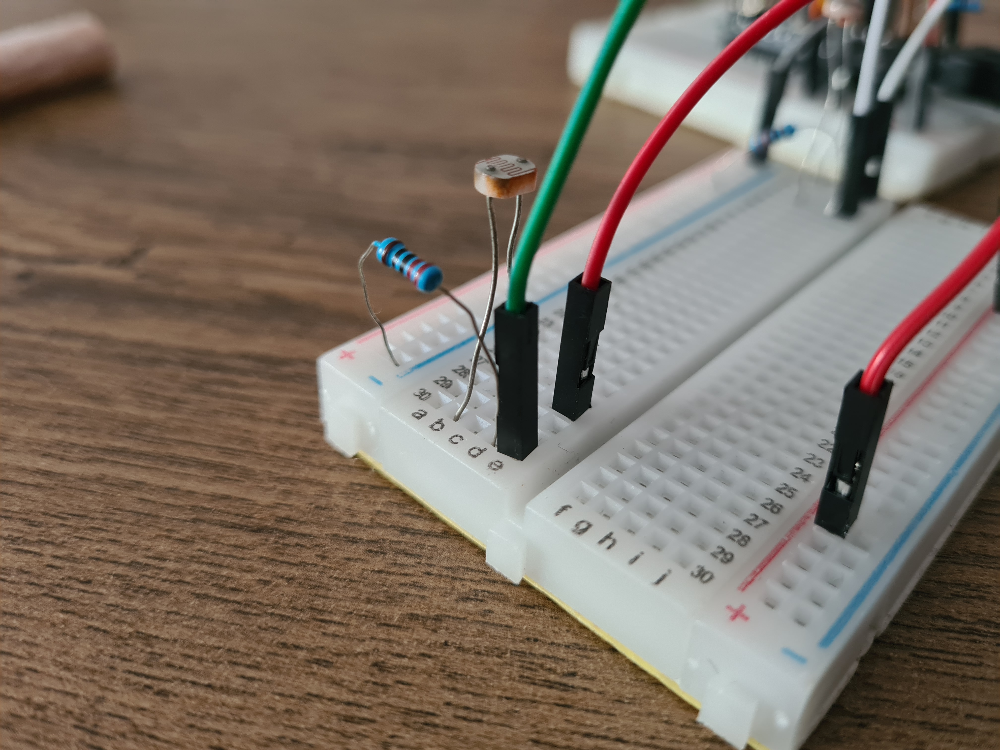
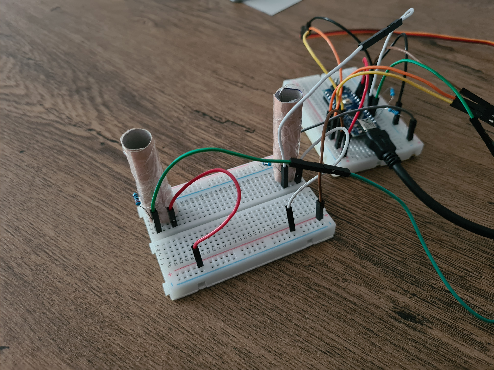

# Solar and wind energy combination project

### This is my bachelor's thesis project and it has two main components:

1. A conceptual model, shaped like a pole, which was designed to collect renewable energy from two sourses (solar panel and wind turbine)
2. A software for monitoring the system status

The goal of this project was to design a smart conceptual system that combine two diferent renewable energy sources, which could be installed anywhere (for example in park).

  

  
  
  
  

